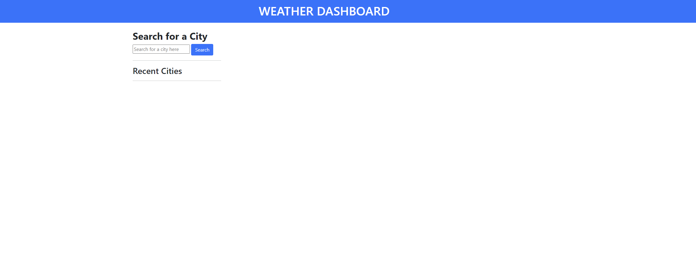
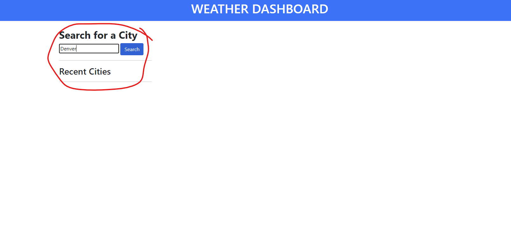
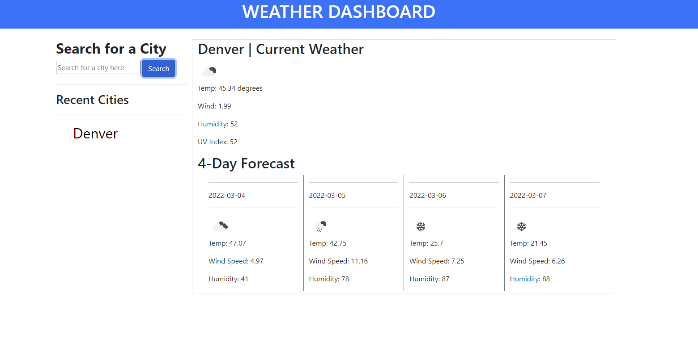
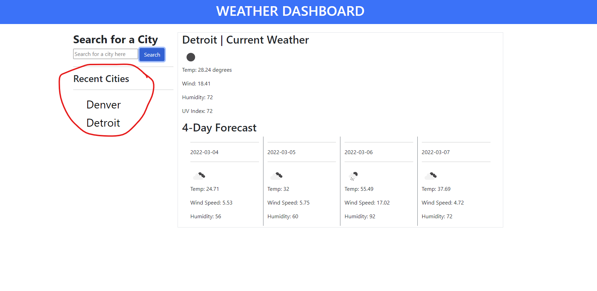

# Weather Dashboard app
​
## Description
​
The purpose of this project is to develop a weather dashboard that a user and continue to pull up to date weather information after searching a particular city within the United States.
​
## Usage
​
1) Upon load the user will notice a blank screen
​
    

2) Once the user enters a city name (US cities only) the user will the be presented with up to date weather info, as well as a 4 day forecast.

    

    

3) After searching for a different city, the user then is presented with a list of recently searched cities to back to a previous search

    
​
## Credits
​
Credit to openweather api for providing the up to date weather information and providing a free api key
​